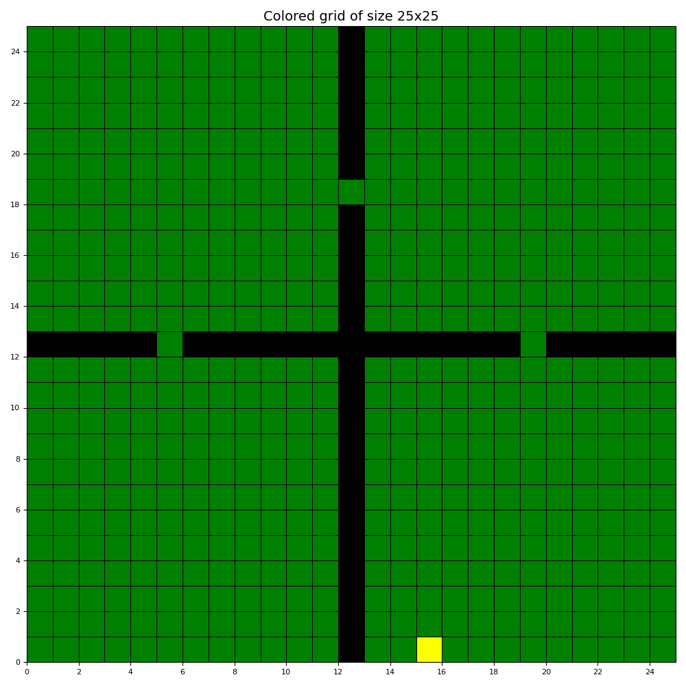
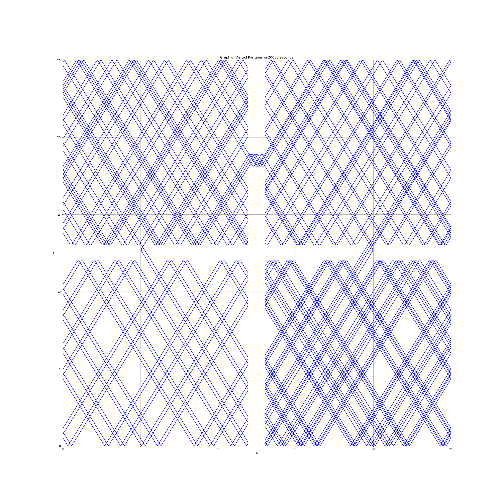
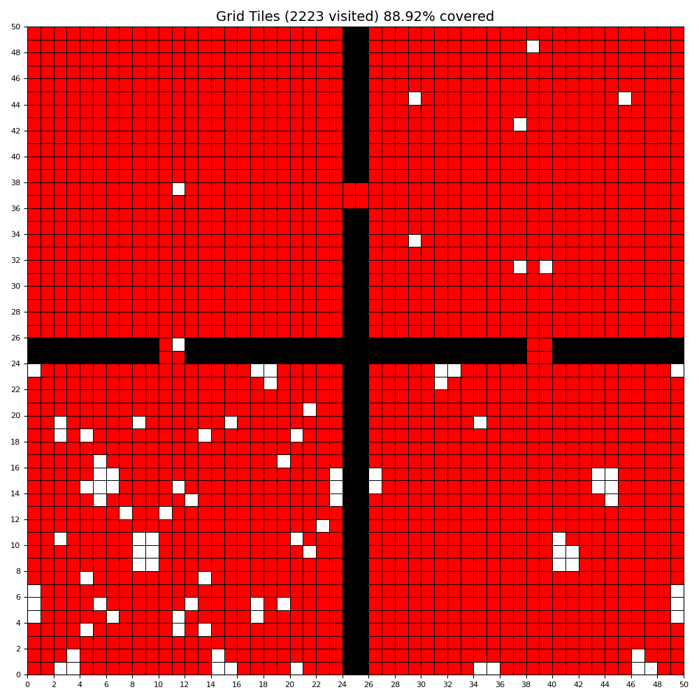

# Robotic Lawnmower Project

This project simulates a robotic lawnmower navigating a grid. Below are some images showcasing the output of the simulation.

## Grid Visualization

### Initial Grid (50x50)

### Visited Path on Grid

### Visited Tiles on Grid

